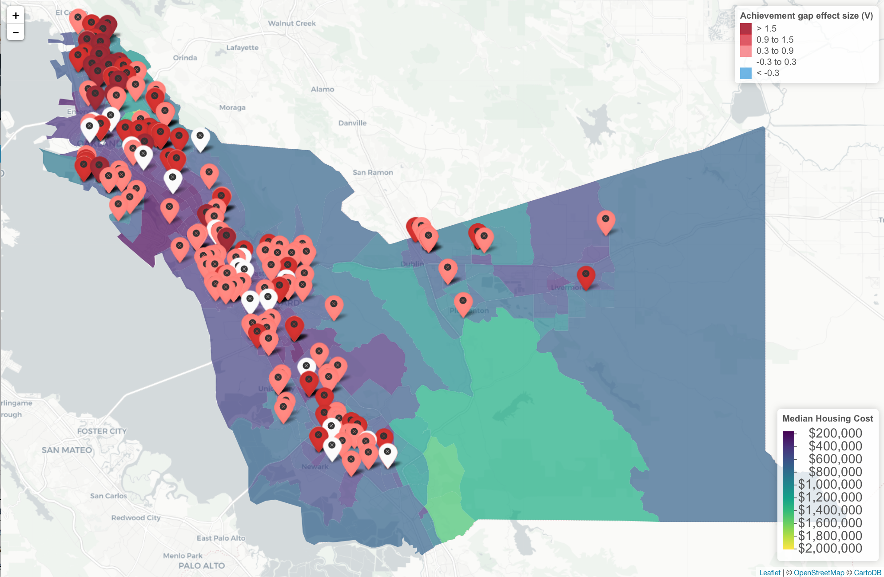
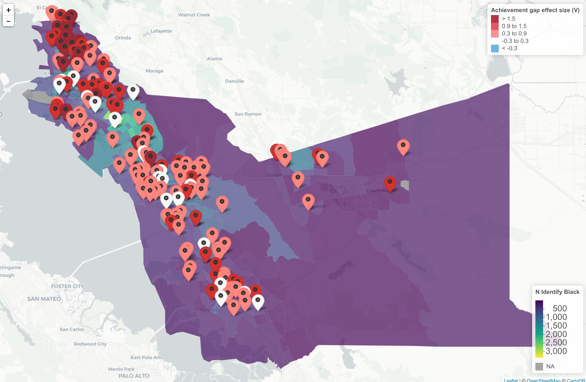
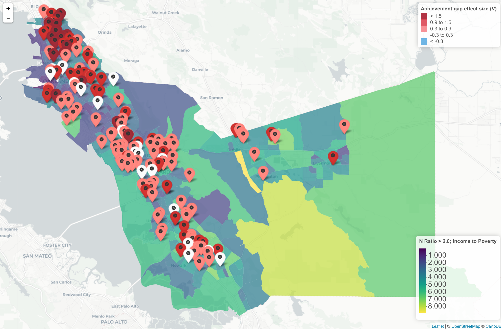

```{r load_packages, include = FALSE, cache = FALSE}
library(tidyverse)
library(fs)
library(patchwork)
library(papaja)
library(knitr)
library(esvis)
library(leaflet)
library(tidycensus)
library(sf)

theme_set(theme_minimal())
theme_update(plot.title = element_text(hjust = 0.5))
options(datatable.showProgress = FALSE,
        tigris_use_cache = TRUE)

opts_chunk$set(echo        = FALSE,
               message     = FALSE,
               warning     = FALSE,
               results     = "asis",
               cache       = TRUE,
               ca.comments = FALSE,
               autodep     = TRUE)
dep_auto()
```

Recent years have seen increased attention on open data (i.e., free and publicly available) as one component of open science [e.g., see @dawes16; @sieber15; @zuiderwijk14]. The National Institute of Health (NIH), for example, recently made 64 data sharing repositories publicly available [@nih_16]. The National Science Foundation (NSF) has placed a similarly high emphasis on making data from funded projects publicly available, as part of their Open Government Plan [@nsf16]. The Institute of Education Sciences (IES) has also moved towards greater requirements for data sharing, with Goal 4 Effectiveness grants requiring a data sharing component since 2013, and Goal 3 Efficacy and Replication awards requiring data sharing since 2016 [@ies16]. Despite these movements, however, data that are fully open remain rare, particularly in educational research. For example, the website data.gov represents the "home of the U.S. Government's open data", housing nearly a quarter of a million datasets. Of these, only 365 were tagged with the keyword "Education" as of this writing, and the vast majority of these receive an openness score of one star out of a possible five.

Privacy issues abound in educational research, given that the research population generally includes minors. Privacy concerns may therefore explain part of the lack of data sharing (although it should be noted that health care and medical research often face similar privacy concerns). One method of avoiding potential issues of confidentiality is to first aggregate the data in some capacity, before releasing the data publicly. This was the approach taken by the *No Child Left Behind Act* [@nclb02], with data reported at the overall school and district levels, but not at the individual student level. NCLB required annual testing in reading and mathematics in each of grades 3-8, and once in high school, with the results reported at the aggregate levels by student subgroups (e.g., gender, race/ethnicity). Cut scores were required to be established, delineating students into various performance level classifications (PLCs). The state of California, for example, included the following four categories in order of increasing competency: "Not Met", "Nearly Met", "Met", and "Exceeds". The proportion of students scoring in each of these categories, by subgroup, were also required to be reported at each of the school and district levels by NCLB, provided a sufficient number of students were represented within each subgroup, such that individual students could not be identified. 

## Evaluating Achievement Gaps With Open Data 
Aggregating the data to higher levels, combined with reporting test score data by PLC proportions, helps avoid privacy concerns and allows the data to be reported publicly. Despite mandates from NCLB on public reporting, however, the openness of these data vary by state, in terms of accessing the data for research purposes. Some (e.g., Oregon, California) make the process easy, with downloadable comma separated value (CSV) files including the proportion of students scoring in each PLC for all schools and/or districts in the state, by student subgroups. Other states make it relatively easy to access the data for an individual school or district (as mandated by NCLB) but rather difficult to access the data across schools or districts. Further, the utility of these data for research purposes is not particularly straightforward. While raw percentages scoring within specific PLCs can be compared between schools or between student subgroups, these differences are highly dependent upon the placement of the cut scores [@ho08; @holland02]. 

Ideally, a transformation could be applied to the "coarsened" data [i.e., continuous test score distributions binned into a set of ordinal categories; @reardon15] to recover the parameters of the full distribution for each subgroup, making the placement of the cut scores inconsequential to evaluating subgroup differences. @ho12 and @reardon15 propose such an approach, in which the coarsened data are used to construct empirical cumulative distribution functions (ECDFs) for each group. Paired ECDFs for any two groups are then evaluated in the form of a probability-probability (PP) plot, and the area under the PP curve (AUC) provides an estimate of the probability that a randomly selected students from the reference distribution (plotted along the x-axis) would score higher than a randomly selected student from the focal distribution [plotted along the y-axis; see @ho12]. This proportion can then be transformed into standard-deviation units, using the following formula, as outlined by @ho09
\begin{equation}
V = \sqrt(2)\Phi^{-1}(AUC)
\end{equation}
Where $\Phi^{-1}$ represents the inverse normal distribution. Under the assumption of respective normality, $V$ is equivalent to Cohen's $d$, and the dependence upon cut scores is removed, given that it is an estimate of the difference between the paired distributions, rather than the difference between proportions at any particular point on the distribution. Importantly, because $V$ can be estimated from coarsened data, it can be used to estimate the overall achievement gap between student subgroups using data that are mandatorily reported as part of NCLB.

## Achievement Gaps in Context
A wealth of previous research has examined achievement differences between student subgroups. @sirin05, for example, conducted a meta-analytic review of the relation between socioeconomic status (SES) and academic achievement. The author found that, while there was a medium to strong overall relation, the magnitude was dependent upon (among other factors) the physical location of the school. This is perhaps unsurprising, given that schools draw students from the surrounding neighborhoods, and any disparities between neighborhoods would naturally flow into disparities between schools. When evaluating achievement gaps, it makes sense to consider characteristics of both the school and the surrounding neighborhood/community. For example, it is possible that the racial/ethnic makeup of the surrounding area would relate to achievement gaps at the school, given that identifying as Black in a school with students predominately identifying as White is very different from identifying as Black in a school where students predominately identify as Black [@hanushek09]. 

In addition to school compositional effects, there is considerable evidence that crime rates in the surrounding area relate to student achievement [e.g., @gonzales96; @mccoy13]. In particular, @bowen99 found that measures of neighborhood danger were predictive of a number of outcomes, but particularly measures of behavior and attendance. The authors found that males and students identifying as African American reported higher rates of exposure to both neighborhood and school danger. These results are particularly relevant for achievement gaps when considering @lee09 found that "Black students were 2.88 times more likely than White peers to reside in the neighborhoods with high crime-high poverty" (p. 165). Further, as noted by @gregory10, large racial disproportionality exists in terms of school-wide suspension and expulsion rates. This disproportionality may be partially attributable to neighborhood/community differences, which ultimately lead to fewer opportunities for students to learn (i.e., more time spent out of the classroom) and a broadening of the achievement gap.

## Summary
The purpose of this paper is to evaluate differences in achievement gaps between schools using open, publicly available data, reported by schools on a mandatory basis as part of NCLB. We begin, however, by first evaluating $V$ using empirical, student-level data collected across the state of Oregon. Specifically, we evaluate the extent to which $V$ corresponds with $d$ when using the full sample. We expect a strong but imperfect relation, given the differing assumption of the two effect sizes. We then manually coarsen the data into the proportion of students scoring in each PLC, re-estimate $V$, and compare the estimates to those made from the continuous data. Following this investigation, we illustrate how this approach can be useful when working with publicly available data, specifically by using $V$ to calculate achievement gap effect sizes for schools in California and Oregon, combining these data with census data, and producing geo-spatial maps to evaluate both the clustering of school-level estimates of achievement gaps, and the extent to which any clustering relates to the demographics of the surrounding area (e.g., median housing cost). The following research questions were addressed:

1. To what extent does $V$ estimated with the full data correspond with $V$ estimated from the coarsened data, and to what extent do these estimates correspond with $d$?
2. What does the distribution of school-level achievement gaps look like (i.e., shape and variance) in California and Oregon?
3. Do school-level achievement gap estimates tend to be geographically clustered, and if so, does this clustering relate to demographic characteristics of the surrounding area?

# Method
## Data Sources
Multiple sources of data were used. Student-level data included all students in the state of Oregon who took the reading/language arts or mathematics assessments during the 2012-2013 school year. These data are summarized by content area and race/ethnicity in Table 1, and were collected as part of the National Center on Assessment and Accountability for Special Education (NCAASE; see http://ncaase.com), a multi-state collaborative focused on growth modeling and evaluating school effect policies. These data were used to evaluate the correspondence between $V$ and $d$ estimated from the full data, as well as the extent to which $V$ estimated with the discrete (coarsened) data, $V_{d}$, corresponded with $V$ estimated from the full, continuous data, $V_{c}$.

Publicly-available datasets were used to visualize differences in achievement gaps in both Oregon and California. For both states, data on the proportion of students in each subgroup scoring in each PLC were obtained from the corresponding statewide websites [@ca17a; @or17a]. Both states had minimum reporting requirements, although the threshold varied considerably. In California, the minimum reported sample size across student groups was 100, while in Oregon the minimum sample size was only 6. Values below these thresholds in each respective data file were missing.

To map the schools, information on the physical location of the schools, in terms of latitude and longitude, were also necessary. For California, a data file containing this information for all schools in the state was located on the state website [@ca17b]. For Oregon[^1], no specific information on the latitude and longitude of schools could be located. However, a file containing the school name and physical address was located [@or17b]. These addresses were then transformed to latitude and longitude using Google's geocode application programming interface [API; @google]. Geographic information were combined with census data. Specifically, we obtained data on (a) the median housing cost, (b) the number of individuals identifying as Black (for California) or Hispanic/Latino (for Oregon), and (c) the number of individuals with an income to poverty line ratio above 2.0 within each county's census tracts, obtained from the 5-year American Community Survey (ACS) - data collected as part of the nationwide census [@acs].

[^1]: Although preliminary maps were produced for Oregon, we share only the maps from California in this manuscript. We hope to share maps of both Oregon and California during the conference presentation.

```{r descrips}
d <- map_df(dir_ls("data", regexp = "MA|RL"), 
            read_csv, 
            .id = "content_area") %>%
  janitor::clean_names() %>%
  mutate(content_area = str_extract(content_area, "RL|MA"),
         gndr = tolower(gndr)) %>%
  select(rptchkdigitstdntid,
         attnddistinstid,
         attndschlinstid,
         content_area,
         gndr,
         ethniccd,
         enrlgrd,
         pl5b_tot,
         rit_tot) %>%
  rename(ssid   = rptchkdigitstdntid,
         distid = attnddistinstid,
         scid   = attndschlinstid,
         plc    = pl5b_tot,
         rit    = rit_tot)
d %>%
  mutate(`Content Area` = ifelse(content_area == "MA",
                               "Mathematics",
                               "Rdg/Language Arts"),
         ethniccd       = case_when(ethniccd == "A" ~ "Asian",
                                    ethniccd == "B" ~ "Black",
                                    ethniccd == "H" ~ "Hispanic",
                                    ethniccd == "I" ~ "Am. Indian",
                                    ethniccd == "M" ~ "Multiethnic",
                                    ethniccd == "P" ~ "Pac Islander",
                                    ethniccd == "W" ~ "White",
                                    TRUE ~ "Missing")) %>%
  group_by(`Content Area`, ethniccd) %>%
  summarize(n    = as.character(n()),
            mean = mean(rit, na.rm = TRUE),
            sd   = sd(rit, na.rm = TRUE)) %>%
  apa_table()
```

## Analyses
All analyses were conducted within the R statistical computing environment [@r]. The *tidyverse* suite of packages [@tidyverse] were used for all data preparation and visualization, along with *patchwork* to combine multiple plots [@patchwork]. Effect sizes were estimated using the *esvis* package [@esvis], and maps were produced using a combination of the *leaflet* [@leaflet] and *tidycensus* [@tidycensus] packages. Many of the publicly available datasets were read into R directly from the web using the *rio* package [@rio]. Finally, in the spirit of open and reproducible research, all the code used to produce this manuscript are publicly available in the form of a GitHub repository[^2]. The document itself was produced using the *papaja* package, which is an an R Markdown extension for rendering manuscripts formatted according to the standards of the American Psychological Association [see @papaja]. 

[^2]: see https://github.com/DJAnderson07/ncme_18

### Effect size comparison
Student-level data from Oregon were used to empirically estimate achievement gap effect sizes by school. Across all effect size analyses, we pooled data across grades to estimate a single effect size, rather than estimating separate effects by grade. For the purposes of this investigation, we evaluated achievement gaps between students identifying as Hispanic/Latino and students identifying as White for all schools that met the minimum reporting size for both groups. Cohen's $d$ was estimated as
\begin{equation}
d = \frac{\bar{X}_{foc} - \bar{X}_{ref}}
        {\sqrt{\frac{(n_{foc} - 1)\sigma_{foc} + (n_{ref} - 1)\sigma_{ref}}
                  {n_{foc} + n_{ref} - 2}}}
\end{equation}
where $foc$ represents the focal group, in this case students identifying as Hispanic/Latino, and $ref$ represents the reference group (students identifying as White). The numerator represents the difference in the means of the two distributions, while the denominator represents the pooled standard deviation. The $V_c$ effect size was then estimated with the same data, and for the same set of schools. Comparisons between $V_c$ and $d$ were assessed both in terms of the correlation between the measures, as well as in terms of how discrepant $V_c$ was from $d$. 

Following the evaluation of $V_c$ with $d$, we collapsed the data into counts by PLC within each school - i.e., we manually coarsened the data. We then estimated $V_d$ ($V$ estimated from discrete data) and compared these estimates with both $V_c$ and $d$. As stated previously, we expected $V_c$ and $d$ to differ marginally, given the different assumptions of the estimators. However, any differences in $V_c$ and $V_d$ could be interpreted as differences that arose due to the coarsening of the data. 

### Evaluating school-level achievement gap estimates
Publicly available data reporting on the percentage of students scoring in each PLC were obtain for California and Oregon, as described previously. Both files reported percentages by grade and across grades, by student subgroups. Similar to the student-level analyses, we used the pooled percentages across grades, rather than conducting separate analyses by grade. The Black-White achievement gap was estimated for California, while the Hispanic-White achievement gap was estimated for Oregon. In both cases, schools were only included if they reported percentages for both groups (i.e., met the minimal reporting threshold).

State level evaluations were followed up with county-level investigations using geographic and census data. Census tracts represent geographic areas with between approximately 1,200 to 8,000 people, with an optimum size of 4,000 people. Geographic boundaries of the census tracts were also obtained from the ACS survey. Maps were then produced with the census tracts overlayed and colored according to the respective variable. Schools were displayed as "pins" on the map, and were colored according to the magnitude of the estimated achievement gap. The relation between achievement gaps at the school level and demographic characteristics of the surrounding area were then visually examined. All maps were interactive, helping to facilitate exploration (e.g., zoom, pan). In our results, we share screen captures from these maps, although it is recognized that some of the features are difficult to portray through static images.

# Results
## Effect Size Comparisons

```{r, coh_v_compare1}
schls <- d %>% 
  filter(ethniccd == "W"| ethniccd == "H") %>% 
  group_by(scid, ethniccd, content_area) %>% 
  mutate(n = n()) %>% 
  filter(n > 6) %>% 
  group_by(scid, content_area) %>% 
  count(ethniccd) %>% 
  mutate(n = n()) %>% 
  filter(n == 2) %>% 
  semi_join(d, .)

es_c <- schls %>% 
  group_by(scid, content_area) %>% 
  nest() %>% 
  mutate(d = map_dbl(data, ~coh_d(rit ~ ethniccd, ., ref_group = "W")$estimate),
         v_c = map_dbl(data, ~v(rit ~ ethniccd, ., ref_group = "W")$estimate),
         dvc_diff = v_c - d,
         content_area = ifelse(content_area == "MA", 
                                "Mathematics", 
                                "Rdg/Language Arts"))
  
vd_c <- ggplot(es_c, aes(v_c, d)) +
  geom_point(color = "gray50") +
  geom_density2d(color = "gray80") +
  xlim(-2, 1.5) +
  geom_smooth(color = "cornflowerblue") +
  facet_wrap(~content_area) +
  labs(x = expression(V[c]),
       y = expression(d),
       title = "Bivariate Relation")

vdiff_c <- ggplot(es_c, aes(dvc_diff)) +
  geom_histogram(alpha = 0.7, bins = 35) +
  geom_vline(aes(xintercept = mean(dvc_diff, na.rm = TRUE)),
             color = "cornflowerblue", 
             lwd = 1.3) +
  facet_wrap(~content_area) +
  labs(x = expression(V[c] - D),
       y = "Count",
       title = "Effect Size Differences")

dvc_cor <- es_c %>% 
  group_by(content_area) %>% 
  summarize(cor = round(cor(v_c, d), 2))
```

```{r, fig.cap= "Differences in Cohen's D and V estimated with continuous data", fig.height=8}
vd_c / vdiff_c 
```

Figure 1 displays the relation between $V_c$ and $d$ both in terms of the bivariate relation and the distribution of differences with respect to $V_c$ for both mathematics and reading/language arts. For the bivariate relation, the x-axis was restricted to span -2 to 1.5, which resulted in the removal of one outlier point (which had little effect on the overall trend, but nonetheless made the bulk of the data more difficult to see). Topographical lines are displayed on top of the points to help display the density of the data, given that many points overlapped. The majority of the estimates were negative, as measured by either $V_c$ or $d$, indicating that students identifying as Hispanic/Latino performed, on average, lower than students identifying as White in most schools across Oregon. Note that there were a few schools for both content areas, however, where the achievement gap was reversed (i.e., students identifying as White scored, on average, lower than students identifying as Hispanic/Latino). Overall, $V_c$ and $d$ correlated at `r dvc_cor$cor[dvc_cor$content_area == "Mathematics"]` for mathematics and `r dvc_cor$cor[dvc_cor$content_area == "Rdg/Language Arts"]` for reading/language arts. For the histograms, the vertical line represents the mean of the differences for the corresponding content area. Note that the mean for each content area was slightly negative ($M_{mth} =$ `r round(tapply(es_c$dvc_diff, es_c$content_area, mean)["Mathematics"], 2)`, $M_{rdg} =$ `r round(tapply(es_c$dvc_diff, es_c$content_area, mean)["Rdg/Language Arts"], 2)`), indicating that, on average for this sample, $V_c$ represented a slightly lower estimate of the effect size (less positive/more negative) relative to $d$. The distributions had a standard deviation of `r round(tapply(es_c$dvc_diff, es_c$content_area, sd)["Mathematics"], 2)` and `r round(tapply(es_c$dvc_diff, es_c$content_area, sd)["Rdg/Language Arts"], 2)` for mathematics and reading/language arts respectively.


```{r v_coarsened_compare}
schls_coarsened <- schls %>% 
  group_by(content_area, scid, ethniccd, plc) %>% 
  count() %>% 
  group_by(scid, ethniccd, content_area) %>% 
  mutate(pct = n/sum(n)) %>% 
  select(-n) %>% 
  spread(plc, pct) %>% 
  mutate(`-1` = 0) %>% 
  gather(plc, pct, -1:-3, convert = TRUE) %>% 
  arrange(scid, ethniccd, plc) %>% 
  mutate(cum_pct = cumsum(ifelse(is.na(pct), 0, pct))) %>% 
  select(-pct) %>% 
  spread(ethniccd, cum_pct) 

es_d <- schls_coarsened %>% 
  group_by(scid, content_area) %>% 
  summarize(auc = sfsmisc::integrate.xy(H, W, use.spline = FALSE), 
            v_d   = sqrt(2)*qnorm(auc)) %>% 
  mutate(content_area = ifelse(content_area == "MA", 
                                "Mathematics", 
                                "Rdg/Language Arts"))

es <- left_join(es_c, es_d) %>% 
  mutate(dvd_diff = v_d - d,
         vcvd_diff = v_d - v_c)

d_vd <- ggplot(es, aes(v_d, d)) +
  geom_point(color = "gray50") +
  geom_density2d(color = "gray80") +
  geom_smooth(color = "cornflowerblue") +
  facet_wrap(~content_area) +
  labs(x = expression(V[d]),
       y = expression(d),
       title = "Bivariate Relation") +
  theme(plot.title = element_text(hjust = -0.2))

vc_vd <- ggplot(es, aes(v_d, v_c)) +
  geom_point(color = "gray50") +
  geom_density2d(color = "gray80") +
  geom_smooth(color = "cornflowerblue") +
  facet_wrap(~content_area) +
  labs(x = expression(V[d]),
       y = expression(V[c]),
       title = " ")

dvd_diff <- ggplot(es, aes(dvd_diff)) +
  geom_histogram(alpha = 0.7, bins = 35) +
  geom_vline(aes(xintercept = mean(dvd_diff, na.rm = TRUE)),
             color = "cornflowerblue", 
             lwd = 1.3) +
  xlim(-1.5, 1.5) +
  facet_wrap(~content_area) +
  labs(x = expression(V[d] - d),
       y = "Count",
       title = "Effect Size Differences") +
  theme(plot.title = element_text(hjust = -0.2))

vcvd_diff <- ggplot(es, aes(vcvd_diff)) +
  geom_histogram(alpha = 0.7, bins = 35) +
  geom_vline(aes(xintercept = mean(vcvd_diff, na.rm = TRUE)),
             color = "cornflowerblue", 
             lwd = 1.3) +
  xlim(-1.5, 1.5) +
  facet_wrap(~content_area) +
  labs(x = expression(V[d] - V[c]),
       y = "Count",
       title = " ")

cors <- es %>% 
  group_by(content_area) %>% 
  summarize(mean_dvd_diff  = round(mean(dvd_diff), 2),
            mean_vcvd_diff = round(mean(vcvd_diff), 2),
            cor_dvd  = round(cor(d, v_d), 2),
            cor_vcvd = round(cor(v_c, v_d), 2))
```

```{r fig.cap = "Differences in V estimated from coarsened data, and V and Cohen's D estimated from continuous data", fig.height = 8}
(d_vd + vc_vd) / (dvd_diff + vcvd_diff)
```

Figure 2 displays the bivariate relation and differences between $V_d$ estimated with discrete (coarsened) data, and Cohen's $d$ and $V_c$ estimated with the full data. As would be expected, the relation between $V_d$ and $d$ was less strong than the relation between $V_c$ and $d$. However, the overall relation was still quite strong, correlating at `r cors$cor_dvd[cors$content_area == "Mathematics"]` and `r cors$cor_dvd[cors$content_area == "Rdg/Language Arts"]` for mathematics and reading/language arts, respectively. The standard deviations of the differences were also marginally more broad, at `r round(tapply(es$dvd_diff, es$content_area, sd)["Mathematics"], 2)` and `r round(tapply(es$dvd_diff, es$content_area, sd)["Rdg/Language Arts"], 2)`, respectively. The coarsening of the data did also lead to some differences in the estimated effect between $V_c$ and $V_d$. The correlations were similar in magnitude to $V_c$ and $d$, correlating at `r cors$cor_vcvd[cors$content_area == "Mathematics"]` and `r cors$cor_vcvd[cors$content_area == "Rdg/Language Arts"]` for mathematics and reading/language arts, respectively. The distribution of differences centered on `r cors$mean_vcvd_diff[cors$content_area == "Mathematics"]` and `r cors$mean_vcvd_diff[cors$content_area == "Rdg/Language Arts"]` for mathematics and reading/language arts, respectively, implying that, on average, there was very little difference between $V$ calculated with the continuous data ($V_c$) and $V$ calculated with the discrete data ($V_d$). The standard deviations of these distributions were `r round(tapply(es$vcvd_diff, es$content_area, sd)["Mathematics"], 2)` and `r round(tapply(es$dvd_diff, es$content_area, sd)["Rdg/Language Arts"], 2)`. 

## School-Level Achievement Gaps

```{r school_achievement_gaps}
#### Oregon ####
or_base_url <- "http://www.oregon.gov/ode/educator-resources/assessment/TestResults2017/"
or <- rio::import(paste0(or_base_url, "pagr_schools_math_all_1617.xlsx"),
                  setclass = "tbl_df", 
                  na = c("-", "--", "*")) %>% 
  janitor::clean_names()

or <- or %>% 
  select(district_id:school, 
         student_group, 
         grade_level, 
         starts_with("percent_level")) %>% 
  filter(grade_level == "All Grades",
         student_group == "Hispanic/Latino" | 
           student_group == "White") %>% 
  gather(plc, percent, starts_with("percent")) %>% 
  filter(!is.na(percent)) %>% 
  mutate(plc = parse_number(plc))

# Select for only schools with both groups represented
or <- or %>% 
  group_by(school_id) %>% 
  count(student_group) %>%
  ungroup() %>% 
  count(school_id) %>% 
  filter(nn == 2) %>% 
  semi_join(or, .)

or <- or %>% 
  mutate(percent = percent / 100) %>% 
  spread(plc, percent) %>% 
  mutate(`-1` = 0) %>% 
  gather(plc, percent, `1`:`-1`, convert = TRUE) %>% 
  arrange(school_id, student_group, plc) %>% 
  group_by(school_id, student_group) %>% 
  mutate(cumsum = cumsum(percent)) %>% 
  select(-percent) %>% 
  spread(student_group, cumsum) %>% 
  janitor::clean_names()

or_es <- or %>% 
  group_by(school_id) %>% 
  nest() %>% 
  mutate(auc = map_dbl(data, ~sfsmisc::integrate.xy(.$hispanic_latino,
                                                    .$white,
                                                    use.spline = FALSE)),
         v   = sqrt(2)*qnorm(auc))
or_schools <- or_es %>% 
  mutate(positive = ifelse(v > 0, "above", "below")) %>% 
ggplot(aes(v, fill = positive)) +
  geom_histogram(alpha = 0.7, bins = 75) +
  geom_vline(aes(xintercept = mean(v)), 
             color = "cornflowerblue",
             lwd = 1.5) + 
  scale_fill_manual(values = c("black", "gray40")) +
  guides(fill = "none") +
  labs(x = expression(V[d]),
       y = "Count",
       title = "Oregon",
       subtitle = "Hispanic/Latino - White Achievement Gap") +
  theme(plot.subtitle = element_text(hjust = 0.5))

#### California ####
ca_base_url <- "http://www3.cde.ca.gov/caasppresearchfiles/2017/sb/"
ca <- rio::import(paste0(ca_base_url, "sb_ca2017_all_csv_v2.zip"),
                  which = "sb_ca2017_all_csv_v2.txt",
                  setclass = "tbl_df",
                  na = "*") %>% 
  janitor::clean_names()

ca_subgroups <- rio::import(paste0(ca_base_url, "subgroups.zip"),
                            setclass = "tbl_df", 
                            na = "*")
names(ca_subgroups)[2:4] <- c("subgroup_id", "subgroup_cat", "subgroup")

ca <- left_join(ca, ca_subgroups[ ,-1]) %>% 
  mutate(test_id = ifelse(test_id == "1", "ELA", "Math")) %>% 
  filter(test_id == "Math") %>% 
  select(county_code:school_code, subgroup_id, subgroup_cat, grade, test_id,
         percentage_standard_exceeded,
         percentage_standard_met,
         percentage_standard_nearly_met, 
         percentage_standard_not_met) %>% 
  gather(plc, percent, starts_with("percentage")) %>% 
  mutate(plc = str_replace(plc, "percentage_standard_", ""))

ca_props <- ca %>% 
  filter(subgroup_id == "74" |
         subgroup_id == "80",
         grade == 13) %>% 
  mutate(percent = as.numeric(percent)/100,
           plc = case_when(plc == "exceeded" ~ 4,
                           plc == "met" ~ 3,
                           plc == "nearly_met" ~ 2,
                           plc == "not_met" ~ 1,
                           TRUE ~ 999)) %>% 
  filter(!is.na(percent), 
         school_code != "0000000") %>% 
  spread(plc, percent) %>% 
  mutate(`-1` = 0) %>% 
  gather(plc, percent, `1`:`-1`, convert = TRUE) %>% 
  arrange(school_code, subgroup_id, grade, test_id, plc) %>% 
  group_by(school_code, subgroup_id, grade, test_id) %>% 
  mutate(cumsum = cumsum(percent)) %>% 
  ungroup() %>% 
  select(-subgroup_id, -percent) %>% 
  spread(subgroup_cat, cumsum) %>% 
  na.omit() %>% 
  rename("black" = `Black or African American`,
         "white" = "White")

ca_es <- ca_props %>% 
  group_by(school_code, test_id, grade) %>% 
  nest() %>% 
  mutate(auc = map_dbl(data, 
                       ~sfsmisc::integrate.xy(.$black, 
                                              .$white, 
                                              use.spline = FALSE)), 
         v   = sqrt(2)*qnorm(auc))

ca_schools <- ca_es %>% 
  mutate(positive = ifelse(v > 0, "above", "below")) %>% 
ggplot(aes(v, fill = positive)) +
  geom_histogram(alpha = 0.7, bins = 75) +
  geom_vline(aes(xintercept = mean(v)), 
             color = "#8da0cb",
             lwd = 1.5) + 
  scale_fill_manual(values = c("black", "gray40")) +
  guides(fill = "none") +
  labs(x = expression(V[d]),
       y = "Count",
       title = "California",
       subtitle = "Black-White Achievement Gap") +
  theme(plot.subtitle = element_text(hjust = 0.5))
```

```{r fig.cap = "Distribution of Achievement Gap Effect Sizes in Oregon and California"}
or_schools + ca_schools
```

### Overall Estimates by State
Using publicly available data, we calculated the Black-White achievement gap for all schools meeting minimum reporting criteria for both groups of students in California, and the Hispanic/Latino achievement gap for all schools meeting minimum reporting criteria for both groups in Oregon. For both states, we limited the analysis to only mathematics. Figure 3 displays the distribution of effects for each state, with the mean displayed by the vertical line. Schools with an estimated effect above zero represent schools in which the average achievement of White students was below the corresponding focal group. This portion of each corresponding distribution is displayed by a dark gray color and, for both states, represented very few schools relative to the total distribution. The overall mean Hispanic/Latino - White achievement gap in Oregon was `r round(mean(or_es$v), 2)` with a standard deviation of `r round(sd(or_es$v), 2)`. In California, the average Black-White achievement gap was estimated at `r round(mean(ca_es$v), 2)` with a standard deviation of `r round(sd(ca_es$v), 2)`. When interpreting these numbers, it is important to keep in mind that these represent the mean and variance of school-level achievement gaps. In other words, the overall achievement gap for each state may be marginally different, given that these estimates represent the mean of group means (which are unbalanced).

### Mapping the Estimates
```{r maps, eval = FALSE}
#### California ####
ca_es <- ca_es %>% 
  mutate(county = map_chr(data, ~unique(.$county_code)))

ca_sch_names <- rio::import(paste0(ca_base_url, "sb_ca2017_all_csv_v2.zip"),
                  which = "sb_ca2017entities_csv.txt",
                  setclass = "tbl_df",
                  na = "*") %>% 
  janitor::clean_names() %>%  
  select(school_code, school_name, county_name)

ca_es <- left_join(ca_es, ca_sch_names) %>% 
  mutate(school_name = tolower(school_name))

addies <- read_csv("data/pubschls.csv") %>% 
  janitor::clean_names() %>% 
  unite(address, street, city, state, zip, sep = " ") %>% 
  select(school, address, county, latitude, longitude) %>% 
  mutate(school = tolower(school)) %>% 
  rename(school_name = school,
         county_name = county)

ca_es <- left_join(ca_es, addies)
alameda <- ca_es %>% 
  filter(county == "01", 
         test_id == "Math",
         grade == 13) %>% 
  na.omit()

# Inspect variable to plot
# v16 <- load_variables(2016, "acs5", cache = TRUE)
# View(v16)

alameda_house <- get_acs(geography = "tract", 
                         variables = "B25077_001", 
                         state = "CA",
                         county = "Alameda",
                         geometry = TRUE) %>% 
  filter(estimate > 0) %>% 
  rename(median_house = estimate) %>% 
  select(-variable, -moe)

alameda_black <- get_acs(geography = "tract", 
                         variables = "C02003_004E", 
                         state = "CA",
                         county = "Alameda",
                         geometry = FALSE) %>% 
  filter(estimate > 0) %>% 
  rename(n_black = estimate)  %>% 
  select(-variable, -moe)

alameda_poverty <- get_acs(geography = "tract", 
                           variables = "C17002_008E", 
                           state = "CA",
                           county = "Alameda",
                           geometry = FALSE) %>% 
  filter(estimate > 0) %>% 
  rename(n_poverty = estimate) %>% 
  select(-variable, -moe)
  

alameda_geo <- left_join(alameda_house, alameda_black, st_join = FALSE)
alameda_geo <- left_join(alameda_geo, alameda_poverty)

pal_house <- colorNumeric(palette = "viridis", 
                    domain = alameda_geo$median_house)
pal_black <- colorNumeric(palette = "viridis", 
                    domain = alameda_geo$n_black)
pal_pov <- colorNumeric(palette = "viridis", 
                    domain = alameda_geo$n_poverty)

pal_col <- function(df) {
  sapply(df[["v"]], function(rating) {
    if(rating > 0.3) {
      "blue"
    } else if(rating <= 0.3 & rating > -0.3) {
      "white"
    } else if(rating <= -0.3 & rating > -0.9) {
      "lightred"
    } else if(rating <= -0.9 & rating > -1.5) {
      "red"
    } else {
      "darkred"
    } })
}

icons <- awesomeIcons(
  icon = 'ios-close',
  iconColor = 'black',
  library = 'ion',
  markerColor = pal_col(alameda)
)

alameda_geo %>%
  st_transform(crs = "+init=epsg:4326") %>%
  leaflet() %>%
  addProviderTiles(provider = "CartoDB.Positron") %>%
  addPolygons(popup = ~ str_extract(NAME, "^([^,]*)"),
              stroke = FALSE,
              smoothFactor = 0,
              fillOpacity = 0.7,
              color = ~ pal_house(median_house)) %>%
  addLegend("bottomright", 
            pal = pal_house, 
            values = ~ median_house,
            title = "Median Housing Cost",
            labFormat = labelFormat(prefix = "$"),
            opacity = 1) %>% 
  addAwesomeMarkers(data = alameda, 
                    ~longitude, 
                    ~latitude, 
                    icon = icons,
                    popup= ~school_name) %>% 
  addLegend("topright", 
            colors = rev(c("#4EA1E1", "fff", "#F27B7B", "#D53B3B", "#9C0E0E")),
            labels = rev(c("< -0.3",
                       "-0.3 to 0.3", 
                       "0.3 to 0.9", 
                       "0.9 to 1.5", 
                       "> 1.5")),
            title = "Achievement gap effect size (V)",
            opacity = 0.8)

alameda_geo %>%
  st_transform(crs = "+init=epsg:4326") %>%
  leaflet() %>%
  addProviderTiles(provider = "CartoDB.Positron") %>%
  addPolygons(popup = ~ str_extract(NAME, "^([^,]*)"),
              stroke = FALSE,
              smoothFactor = 0,
              fillOpacity = 0.7,
              color = ~ pal_black(n_black)) %>%
  addLegend("bottomright", 
            pal = pal_black, 
            values = ~ n_black,
            title = "N Identify Black",
            opacity = 1) %>% 
  addAwesomeMarkers(data = alameda, 
                    ~longitude, 
                    ~latitude, 
                    icon = icons,
                    popup= ~school_name) %>% 
  addLegend("topright", 
            colors = rev(c("#4EA1E1", "fff", "#F27B7B", "#D53B3B", "#9C0E0E")),
            labels = rev(c("< -0.3",
                       "-0.3 to 0.3", 
                       "0.3 to 0.9", 
                       "0.9 to 1.5", 
                       "> 1.5")),
            title = "Achievement gap effect size (V)",
            opacity = 0.8)

alameda_geo %>%
  st_transform(crs = "+init=epsg:4326") %>%
  leaflet() %>%
  addProviderTiles(provider = "CartoDB.Positron") %>%
  addPolygons(popup = ~ str_extract(NAME, "^([^,]*)"),
              stroke = FALSE,
              smoothFactor = 0,
              fillOpacity = 0.7,
              color = ~ pal_pov(n_poverty)) %>%
  addLegend("bottomright", 
            pal = pal_pov, 
            values = ~ n_poverty,
            title = "N Ratio > 2.0; Income to Poverty",
            opacity = 1) %>% 
  addAwesomeMarkers(data = alameda, 
                    ~longitude, 
                    ~latitude, 
                    icon = icons,
                    popup= ~school_name) %>% 
  addLegend("topright", 
            colors = rev(c("#4EA1E1", "fff", "#F27B7B", "#D53B3B", "#9C0E0E")),
            labels = rev(c("< -0.3",
                       "-0.3 to 0.3", 
                       "0.3 to 0.9", 
                       "0.9 to 1.5", 
                       "> 1.5")),
            title = "Achievement gap effect size (V)",
            opacity = 0.8)
```

Following the estimation of all achievement gaps within each state, we restricted the analyses to Alameda County in California[^3]. Maps were then produced to examine any geographical clustering of school-level achievement gap estimates, as well as features of the surrounding area that may correspond with this clustering. Figures 4, 5, and 6 displays screen captures of an interactive map, with census tracts colored according to the median housing cost,  number of individuals within the tract identifying as Black, and the number of individuals in the tract with an income to poverty line ratio above 2.0, respectively. Note that in addition to providing information about the surrounding area, census tracts also help describe population density, with smaller polygons representing high population density (i.e., more people per square mile). Schools (pins on the map) colored darker red represent larger estimated achievement gaps. In the screen capture, it is somewhat difficult to discern some of the census tracts, particularly smaller tracts (high population density), which tend to correspond with many overlapping schools. However, the clustering of schools corresponding to the estimated achievement gap is still readily apparent. The Northwest section of the map includes a clear cluster of schools with large achievement gaps, with students identifying as Black in these schools performing, on average, more than 1.5 standard deviations below their White peers. The more central portion of the map includes mostly schools with relatively moderate achievement gaps, colored pink ($V_d =$ -0.3 to -0.9), or essentially no achievement gap, colored white ($V_d =$ -0.3 to 0.3). However, even within this cluster of schools with more moderate achievement gaps, there are a few schools with very large achievement gaps. 

[^3]: As mentioned previously, preliminary maps were also produced for Multnomah County in Oregon and we hope to share these maps during the conference. Readers interested in the Oregon results can find similar screen captures in the GitHub repository from the link noted previously. 

In terms of using the surrounding demographics of the area to predict school-level achievement gaps, there are no clearly discernible patterns among any of the maps displayed. Figure 6, displaying the number of people within each tract with an income to poverty ratio above 2.0, has the most variability and there does appear to be a modest relation. In particular, the cluster of schools with high estimated achievement gaps in the Northwest are generally in areas with fewer individuals with an income to poverty ratio over 2.0.







# Discussion
Education has somewhat of a unique challenge when it comes to making data open and accessible, given individuals of a protected class (minors) are included in the vast majority of cases. Aggregating data helps make these data publicly available and more easy to share, but comes with challenges in reducing the overall utility of the data for research purposes. This paper illustrated one method of using publicly available data, which have been reported by all states on a mandatory basis since the implementation of NCLB, to address a substantively meaningful question: How do achievement gaps vary between schools? Overall, the method used to estimate achievement gaps appeared to work well, in terms of the extent to which achievement gap estimates from a full dataset with individual student-level records were recovered when using coarsened data. Further, we were able to combine these effect size estimates with geo-spatial and census data to evaluate the extent to which school-level achievement gaps related to the demographics of the surrounding area.

In this study, the largest gains to evaluating achievement gaps via mapping was the clear cluster of schools found with large achievement gaps. Without looking at the data spatially, or being intimately familiar with the set of schools, we likely would have observed the schools as all having large achievement gaps, but missed that they were nearly all clustered in the same geographical area. The census data did not, in this case, appear to explain much of the underlying mechanisms behind this clustering. However, it is important to note that clear patterns have been found in prior investigations of school variability using census data, using different school-level outcomes [see @anderson17a]. Deeper investigations into the census data may find trends that were not apparent here. 

## Limitation and Directions for Future Research
In this study, we evaluated effect sizes with empirical data. Although this is helpful in determining how a statistic behaves in applied use, it is also a limitation in that "truth" was not known. That is, while Cohen's $d$ and $V_c$ were moderately different, with $V_c$ being marginally lower on average, we cannot state which is more "correct". It is also important to note, however, that any measure of effect size is a summary statistic, summarizing the difference between two distributions. Important differences at specific points in the distribution may therefore be missed by these summary measures. For example, it is possible for large achievement gaps to be apparent at one point in the distribution, and not others, including the directionality of the effect even reversing [@anderson17b; @esvis; @stevens17]. Despite using empirical data, however, we were able to know "truth" relative to the extent that $V_d$ recovered the estimate from $V_c$. 

This research also only preliminarily examined the ACS data, but the ACS, and the census bureau generally, has a wealth of data that have generally been underutilized in educational research. This manuscript investigated three of potentially thousands of variables that could account for variability among schools, not only in achievement gaps, but a host of other outcomes (e.g., graduation rates or behavioral data). A logical extension of this work would be to include data on criminal activity in the area, given the results of @bowen99 and others [e.g., @mccoy13] indicate that neighborhood danger relates to school-wide outcomes. These data are not available as part of the ACS, which is the most up-to-date census dataset, but are available through other US Census Bureau datasets. 

## Conclusions
The approach to estimating school-level achievement gaps illustrated here can lead to potentially rich datasets that can be shared publicly without concerns of jeopardizing student privacy, given that summary-level data are used to produce the estimates. In this study, we estimated achievement gaps for every school in both California and Oregon that met minimum reporting requirements. Future research could use these estimates for further research. For example, it would be interesting to actually model the spatial features, rather than just explore them visually, which could be done by estimating a multilevel model with census tract entered as a random effect. The variability in school-level achievement gaps lying between census tracts could then be estimated, and census variables could be used to account for this variability. An incredible array of questions could  be addressed within this framework, while using only publicly available data.

\newpage
# References
\begingroup
\setlength{\parindent}{-0.5in}
\setlength{\leftskip}{0.25in}

<div id = "refs"></div>
\endgroup
